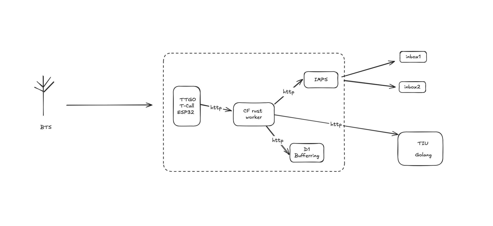
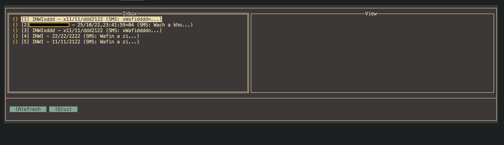

# 📱 TTGO T-Call SMS Forwarder (Lghnay Project)

[](https://opensource.org/licenses/MIT)

A complete IoT solution for forwarding SMS messages to the cloud using the TTGO T-Call ESP32 module with integrated SIM800 GPRS modem. The system captures incoming SMS messages, forwards them to a serverless backend, stores them in a database, and provides real-time email notifications.

## 🌟 Introduction

**Lghnay** (Arabic: لغناي) is a robust SMS forwarding system designed for scenarios where you need to monitor SMS messages remotely. Whether you're tracking verification codes, monitoring alert systems, or simply need remote access to SMS messages, this project provides a complete end-to-end solution.

### 💡 The Story Behind Lghnay
This project was born out of necessity and a bit of frustration. I had two SIM cards but both backup phones decided to die at the most inconvenient time. Rather than buying yet another phone that might die, the solution was obvious: why not build something better?

With a TTGO T-Call board gathering dust in a drawer and a weekend to spare, Lghnay was born - a dedicated SMS gateway that's more reliable than those old backup phones ever were. No screens to crack, no batteries to bloat, no operating systems to update. Just a simple, purpose-built device that does one thing well: forward SMS messages to the cloud where they can be accessed from anywhere.
Sometimes the best solutions come from the most annoying problems. 

### Use Cases

- 📲 Remote SMS monitoring and logging
- 🔐 Two-factor authentication code forwarding
- 🚨 Alert system integration
- 🌐 IoT communication gateway

### Architecture



The project consists of three interconnected components:

1. **Firmware** (C++/Arduino): Runs on the TTGO T-Call ESP32, manages the SIM800 modem, and forwards SMS via WiFi
2. **Worker** (Rust): Cloudflare Workers-based API that receives, stores, and processes SMS data
3. **TUI Client** (Go): Terminal interface for viewing and managing stored messages

## 🚀 Features

### Firmware
- ⚡ Power management with IP5306 boost control
- 📡 Dual connectivity (GSM/GPRS + WiFi with captive portal)
- 🔐 AES-256-CBC encryption for SMS content
- 📨 Real-time SMS reception and parsing
- 🔒 Secure HTTPS data transmission
- 🔄 Automatic reconnection handling

### Worker API
- 🛡️ Custom "Cisab" authentication scheme
- 💾 Cloudflare D1 database integration
- 📧 Email notifications via Resend API
- ⚡ Serverless architecture for scalability
- 🔍 RESTful endpoints for data retrieval

### TUI Client
- 🖥️ Clean terminal user interface
- 🔐 Secure API authentication
- 📋 Message listing and viewing
- 🎨 Easy-to-use command-line interface

## 🔐 Security Features

### End-to-End Encryption

SMS messages are encrypted on the device before transmission using **AES-256-CBC** encryption:

1. **Device Side**: Each message is encrypted with a 256-bit key before being sent to the server
2. **Random IV**: A new initialization vector is generated for each message
3. **Base64 Encoding**: Encrypted data is Base64-encoded for safe JSON transmission
4. **HTTPS Transport**: All data travels over HTTPS for transport layer security

### Encryption Flow

```
Plain SMS → AES-256-CBC Encrypt → Base64 Encode → HTTPS POST → Server
```

The worker must decrypt the messages using the same AES key. This ensures that even if someone intercepts the HTTPS traffic or gains access to your Cloudflare account, they cannot read the SMS content without the encryption key.

### WiFi Configuration Security

- Uses WiFiManager with captive portal for initial setup
- No hardcoded WiFi credentials in the firmware
- Credentials stored securely in ESP32's flash memory
- Access point password protects the configuration interface




---

## 📋 Table of Contents

- [Hardware Requirements](#hardware-requirements)
- [Firmware Setup](#setup)
- [Worker Deployment](#dependencies)
- [TUI Client Usage](#tui-client-usage)
- [Configuration](#configuration)
- [API Reference](#endpoints)
- [Contributing](#contributing)
- [License](#license)

---

## 🔧 Hardware Requirements

- **TTGO T-Call V1.4** (ESP32 with SIM800C/L modem)
- **SIM card** with SMS capability (PIN may be required)
- **USB cable** for programming and power
- **WiFi network** for internet connectivity

---

## 💻 Firmware Setup

### Dependencies

Install the following libraries in your Arduino IDE or PlatformIO:

- [TinyGsmClient](https://github.com/vshymanskyy/TinyGSM) - SIM800 modem communication
- WiFi (ESP32 standard library)
- HTTPClient (ESP32 standard library)
- Wire (I2C library for IP5306)

### Configuration

Create a `config.h` file in your firmware directory:

```cpp
// config.h
#define SerialMon Serial
#define SerialAT Serial1

// IP5306 Power Management
#define IP5306_ADDR 0x75
#define IP5306_REG_SYS_CTL0 0x00

// Modem GPIO Pins
#define MODEM_RST 5
#define MODEM_PWKEY 4
#define MODEM_POWER_ON 23
#define MODEM_TX 27
#define MODEM_RX 26
#define I2C_SDA 21
#define I2C_SCL 22

// WiFi Manager Configuration
const char* AP_name = "TTGO-SMS-Gateway";
const char* AP_password = "12345678";  // Access point password (min 8 chars)

// Server Configuration
const char* serverURL = "https://your-worker-url/set";
const char* apikey = "Your_Auth_Token_Reversed";
const char* simPIN = ""; // Leave empty if no PIN required
```

### Upload

1. Connect your TTGO T-Call ESP32 via USB
2. Select **ESP32 Dev Module** as your board
3. Set upload speed to **115200**
4. Upload the firmware
5. **First Boot Setup**:
   - The device creates a WiFi access point: `Elghnay_AP`
   - Connect to it using password: `12345678` (or your configured AP password)
   - A captive portal appears automatically (or navigate to `192.168.4.1`)
   - Select your WiFi network and enter the password
   - Click Save - the device will reboot and connect to your WiFi
6. Monitor the Serial output to verify SMS reception and forwarding


---

## ☁️ Worker Deployment

### Prerequisites

- [Cloudflare Workers account](https://workers.cloudflare.com/)
- [Wrangler CLI](https://developers.cloudflare.com/workers/wrangler/) installed
- [Resend API account](https://resend.com/) for email notifications

### Environment Variables

Configure the following in your Cloudflare Worker dashboard:

| Name | Type | Description |
|------|------|-------------|
| `AUTH_KEY` | Secret | Un-reversed authentication string |
| `RESEND_API_KEY` | Secret | API key for Resend email service |
| `DB` | D1 Binding | D1 Database binding name |
| `FROM_EMAIL` | Variable | Sender email address |
| `TO_EMAIL` | Variable | Recipient email address for notifications |

### Database Setup

Create a D1 database and run the following SQL:

```sql
CREATE TABLE messages (
    id INTEGER PRIMARY KEY AUTOINCREMENT,
    sender TEXT NOT NULL,
    sms TEXT NOT NULL,
    ts TEXT NOT NULL
);
```

### Deploy

```bash
cd worker
wrangler publish
```

---

## 🖥️ TUI Client Usage

### Prerequisites

- [Go 1.20+](https://golang.org/dl/) installed

### Running

Set environment variables and run:

```bash
export API_URL=https://your-worker-url
export TOKEN=your_reversed_auth_token
go run .
```

Or build and run:

```bash
go build -o ./bin/lghnay-tui
API_URL=https://your-worker-url TOKEN=your_token ./bin/lghnay-tui
```

---

## 🔐 API Reference

### Authentication

All endpoints require the `Authorization` header with the custom "Cisab" scheme:

```
Authorization: Cisab <reversed_token>
```

**About "Cisab" Authentication** 

The name "Cisab" is literally "Basic" spelled backwards - a playful nod to HTTP Basic Authentication while implementing a custom scheme. Instead of the standard `Authorization: Basic <base64>` header, this project uses `Authorization: Cisab <reversed_string>`.

**How it works:**
1. You configure a secret `AUTH_KEY` in your Cloudflare Worker (e.g., `"mySecretKey123"`)
2. To authenticate, you reverse this key: `"321yeKterceSym"`
3. Send the reversed key in the Authorization header: `Authorization: Cisab 321yeKterceSym`
4. The worker reverses it back and compares it to the stored `AUTH_KEY`


### Endpoints

#### Health Check
```http
GET /health
```
Returns API status.

#### Get All Messages
```http
GET /get
```
Returns all stored SMS messages (newest first).

#### Get Single Message
```http
GET /get/:id
```
Returns a specific message by ID.

#### Store Message
```http
POST /set
Content-Type: application/json

{
  "sender": "+1234567890",
  "sms": "Message content",
  "ts": "2025-10-24 12:00:00"
}
```
Stores a new SMS message and triggers email notification.

---

##  Contributing

Contributions are welcome! Please feel free to submit a Pull Request. For major changes, please open an issue first to discuss what you would like to change.


---

##  License

This project is licensed under the MIT License.